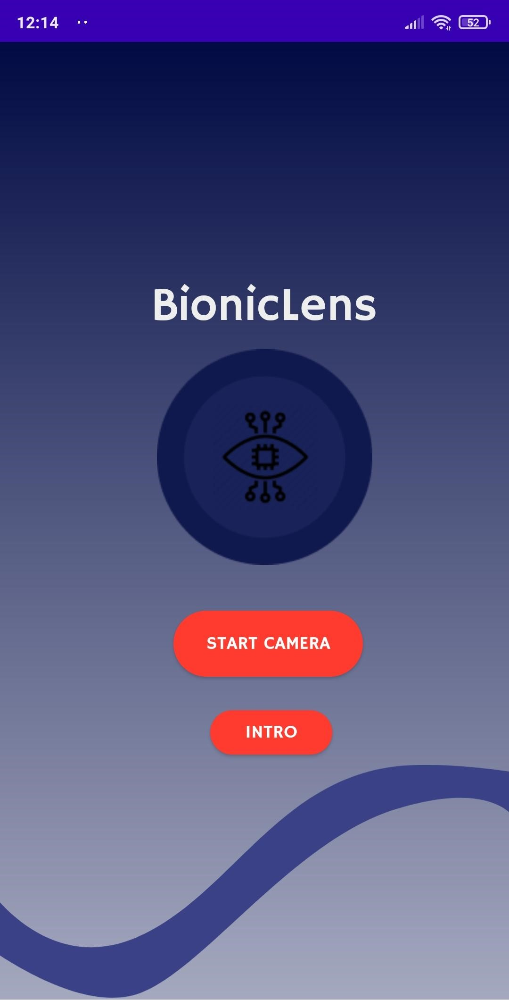
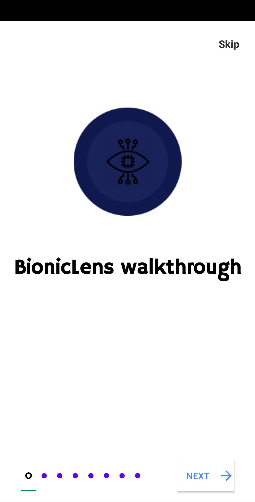
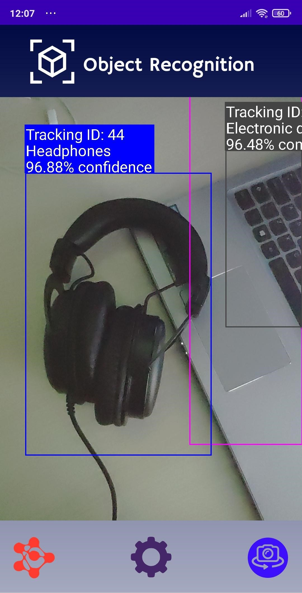
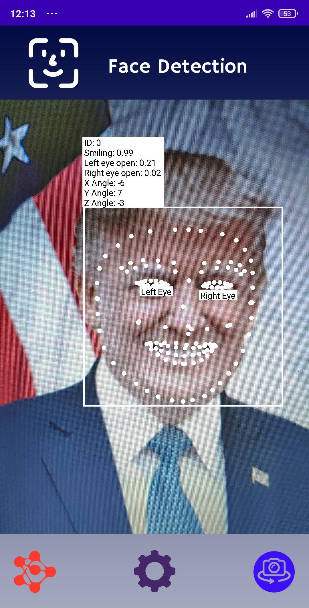
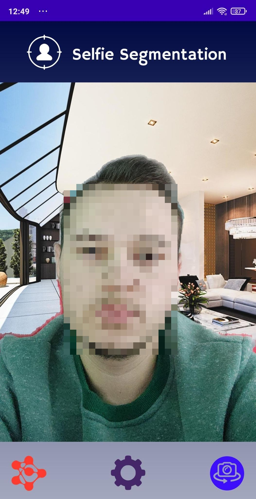
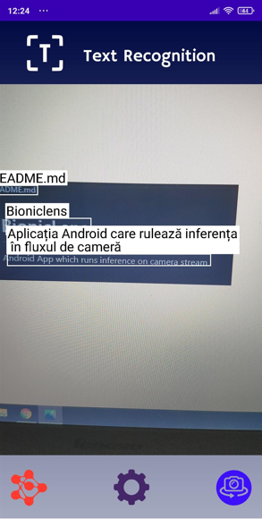

# BionicLens

Android App which showcases multiple Machine Learning Computer Vision applications which can be performed by your mobile phone.

## 📱 Description
Mobile application which runs different Machine Learning use-cases using Google ML KIT APIs on Android. Each use-case is presented as a single activity (All in one app).

Machine learning use-cases from the app:

- Object Recognition
- Face Detection
- Text Recognition and Translation
- Selfie Segmentation
### 📸 Camera
- [📷 CameraX example](app/src/main/java/com/asmaamir/mlkitdemo/CameraX): Preview, Capture and Analyze functionalities

## Functionality
- Real-time object detection, face detection, selfie segmentation and text recognition and translation
  - The application process frames in real time from camera stream
- Object detection
  - For each frame from live camera feed, the activity will detect and recognize different types of objects (up to 631 different types of objects) with a specific               confidence, multiple objects can be present in detection.
  - User has the option to configure the object detection application.
- Face detection
   - Real-time face detection. The application will identify key facial features and contours of detected faces.
   - User has the option to customize the application to focus on specific features that should be detected.
- Text Recognition and Translation
   - Real-time text recognition of any languages with Latin-based, Chinese, Japanese, Korean and Devanagari (Hindi) symbols.
   - User has the option to turn ON real-time translation to either Romanian or English.
   - User will have to wait for the download of new Language Translation Models before they are used for the first time.
- Selfie Segmentation
   - For each person detected, the activity will separate the background and will focus on the person's body.
   - User has the option to choose a virtual background from 3 static images found in the app.
- All results will be displayed in a separate UI instance. 

## Technologies:

Android Studio

Kotlin/Java

Google ML Kit APIs

## Used Models
- Object Detection: [lite-model_object_detection_mobile_object_labeler_v1_1](https://tfhub.dev/google/lite-model/object_detection/mobile_object_labeler_v1/1)

## Installation
- If you clone this repo, you can run the applcation only on a physical device.
- Application APK: [BionicLens.apk](https://github.com/marky1337/BionicLens/raw/master/BionicLens.apk)

## 🤳 Screenshots
### 📝 Main Page

	

### 📝 Intro

	

### :closed_book: Object Recognition

	

### 🎴 Face Detection

	

### :santa: Selfie Segmentation

	

### 🕵️‍♀️ Text Recognition and Translation

	

## 💼 Authors
* **Daniel IONAȘCU** - [GitHub Profile](https://github.com/marky1337)
* **Sebastian BELEA** - [GitHub Profile](https://github.com/belea-sebastian)
